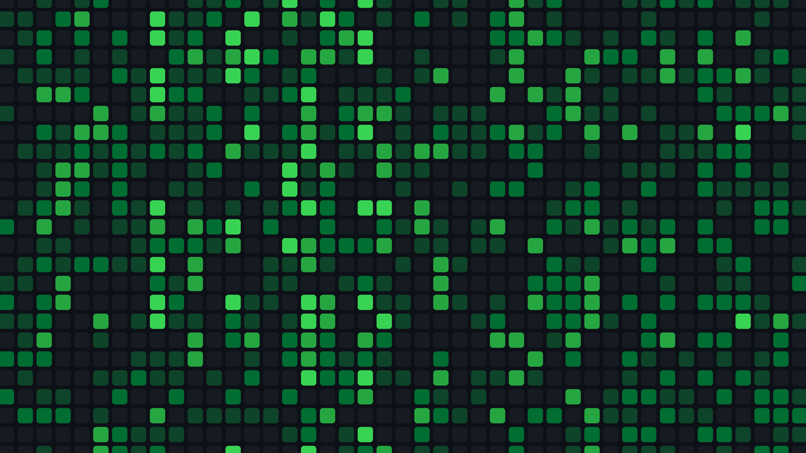

<div align="center">

# omarchy-github-theme

**GitHub Dark theme for Omarchy.**

</div>

<hr>

<div align="center">
● <a href="#installation">Installation</a>  ● <a href="#preview">Preview</a>  ● <a href="#usage">Usage</a>  ● <a href="#docs">Docs</a>  ● <a href="#license">License</a>
</div>

## Installation

```sh
omarchy theme install https://github.com/FAZuH/omarchy-github-theme
```

That applies the theme immediately — kitty, ghostty, alacritty, foot, Hyprland
borders, the Omarchy shell bar, btop, and helix all regenerate from the theme
colors. The tmux status bar follows too if you use the
[omarchy-tmux-theme](https://github.com/FAZuH/dotfiles) hook.

## Preview



## Usage

```sh
omarchy theme set github      # apply (done automatically on install)
omarchy theme bg next         # cycle the bundled wallpapers
omarchy theme bg-switcher     # pick one visually
```

Own wallpapers live in `~/.config/omarchy/backgrounds/github/` and survive
theme reinstalls.

## Docs

- [Design](docs/design.md) — Primer token mapping, wallpaper curation, and preview assets
- [Usage](docs/usage.md) — backgrounds, updating the theme, lock screen
- [Wallpaper sources & rights](LICENSES.md) — what the bundled images are and who owns them
- [Omarchy theming](https://github.com/basecamp/omarchy/blob/main/docs/theming.md) — how themes, backgrounds, and hooks work
- [Primer color tokens](https://github.com/primer/primitives) — the upstream GitHub design tokens this theme is derived from

## License

[MIT](LICENSE) for the theme configuration. The bundled wallpapers are
third-party art — rights remain with their owners, see [LICENSES.md](LICENSES.md).
